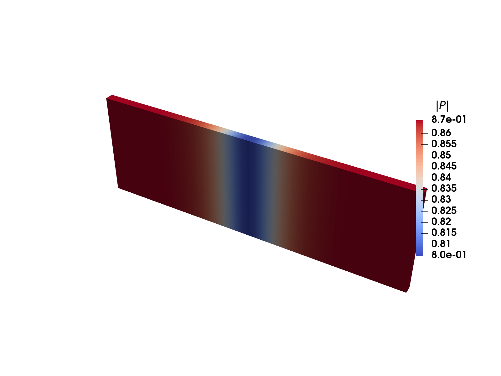
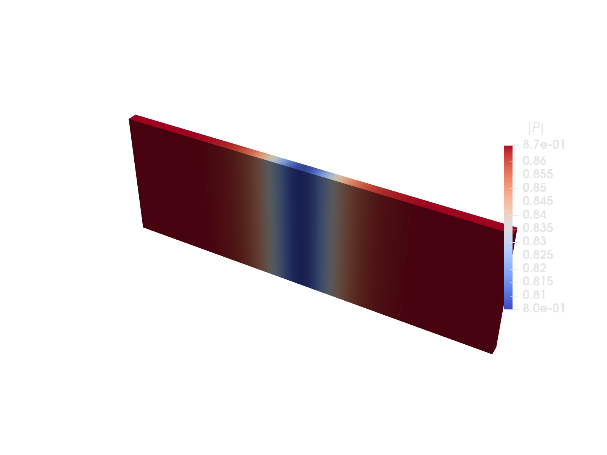

@layout title
@eyebrow HyperHessians.jl
# Forward-mode AD specialized for second-order derivatives
@chips Kristoffer Carlsson | [:github: @KristofferC](https://github.com/KristofferC) | [:mail: kristoffer.carlsson@juliahub.com](mailto:kristoffer.carlsson@juliahub.com) | JuliaCon 2026, Mainz

@chips slides: [kristofferc.github.io/HyperHessians.jl/slides](https://kristofferc.github.io/HyperHessians.jl/slides/)

@fig svg data/qr-slides.svg

---

@layout: center

!big Theory

---

# Automatic Differentiation

- What is Automatic Differentiation (AD)?
- Obtain numerically "exact" derivatives of "subroutines" without having to implement them manually.
- Saves time and avoids bugs.
- Not symbolic differentiation, not expression building
- Reverse vs forward mode differentiation
- This talk: **forward mode**
+ (We do not talk about reverse mode here...)

---

# Finite differences


::: cols
::: panel Taylor, with a step $h$
$$ f(x_0 + h) = f(x_0) + h\,f'(x_0) + \tfrac{h^2}{2}\,f''(x_0) + \cdots $$
$$ f'(x_0) = \frac{f(x_0+h) - f(x_0)}{h} + \mathcal{O}(h) $$
:::

- Big $h$: the dropped Taylor terms dominate.
- Small $h$: the subtraction cancels in floating point.
- Have to call `f` twice
:: col
```julia> | `f(x) = x sin(x²)` at `x = 2`, error vs exact `f′`
julia> f(x) = x * sin(x * x);

julia> fd(f, x, h) = (f(x + h) - f(x)) / h;

julia> exact = sin(4.0) + 8cos(4.0);

julia> fd(f, 2.0, 1e-2)  - exact
0.08441453688334022       # truncation

julia> fd(f, 2.0, 1e-14) - exact
-0.14247963371404015      # cancellation
```
:::

@gap

@gap

<div id="fderrchart" style="margin-top: 10px;"></div>

---

@eyebrow Dual numbers
# Definition and operators

- Complex numbers: $z = a + bi, \quad i^2=-1, \quad \operatorname{Im} [z] = b$
- Dual numbers: $d = x + h\varepsilon, \quad \varepsilon^2 = 0,  \quad \varepsilon[d] = h$

$$ f(d) = f(x + h\,\varepsilon) = f(x) + h f'(x)\,\varepsilon + \underbrace{\tfrac{h^2}{2} f''(x)\,\varepsilon^2 + \cdots}_{=\ 0\ \textbf{exactly}} $$
$$ f'(x) = \varepsilon[f(x + h\,\varepsilon)] / h $$

- Primitives need one rule each: $\ \sin(d) = \sin(x) + h\cos(x)\,\varepsilon$.
- $d_1 d_2 = x_1 x_2 + (x_1 h_2 + x_2 h_1)\,\varepsilon$: the product rule falls out ($h_1 h_2\,\varepsilon^2 = 0$).
- Seed $h = 1$, read the derivative off the $\varepsilon$ slot: $f'(x) = \varepsilon[ f(x + \varepsilon) ]$.

---

@eyebrow Dual numbers
# Implementation

```julia size="14" title="Forward mode AD in Julia"
struct Dual
    x::Float64   # value
    ε::Float64   # epsilon coefficient
end
Base.:+(a::Dual, b::Dual) = Dual(a.x + b.x, a.ε + b.ε)
Base.:*(a::Dual, b::Dual) = Dual(a.x * b.x, a.x * b.ε + b.x * a.ε)  # product rule
Base.sin(d::Dual)         = Dual(sin(d.x), cos(d.x) * d.ε)          # chain rule
derivative(f, x) = f(Dual(x, 1.0)).ε # seed ε = 1, run f, read ε
```


@gap


::: cols
```julia> size="14" title = "No errors"
julia> f(x) = x * sin(x * x);

julia> derivative(f, 2.0)
-5.985951462216824

julia> sin(4) + 8cos(4)
-5.985951462216824
```
:: col
```julia size="12"
julia> @code_warntype optimize=true derivative(f, 2.0)
...
  x::Float64
Body::Float64
1 ─ %1  = intrinsic Base.mul_float(x, x)::Float64
│   %2  = intrinsic Base.mul_float(x, 1.0)::Float64
│   %3  = intrinsic Base.mul_float(x, 1.0)::Float64
│   %4  = intrinsic Base.add_float(%2, %3)::Float64
│   %5  =    invoke Main.sin(%1::Float64)::Float64
│   %6  =    invoke Main.cos(%1::Float64)::Float64
...
```
:::

- Data layout: @fig{cells v d1} where @fig{ cells v = value | d1 = $\varepsilon$ coefficient}


---

@eyebrow Dual numbers
# Higher order derivatives

-  `derivative` is just Julia code, we know how to differentiate that!
- `second_derivative(f, x) = derivative(y -> derivative(f, y), x)`
- Nested `Dual` numbers

@gap
```diff2 size="14"
-struct Dual
-    x::Float64
-    ε::Float64
-end
+struct Dual{T}
+    x::T
+    ε::T
+end
-derivative(f, x) = f(Dual(x, 1.0)).ε
+derivative(f, x) = f(Dual(x, one(x))).ε
+Base.one(d::Dual) = Dual(one(d.x), zero(d.x))
+Base.cos(d::Dual) = Dual(cos(d.x), -sin(d.x) * d.ε)
```
@gap

```julia> size="14"
julia> second_derivative(f, x) = derivative(y -> derivative(f, y), x);

julia> second_derivative(f, 2.0)
16.37395639949036

julia> 12cos(4) - 32sin(4)
16.37395639949036
```

@gap

- Data layout: @fig{cells v d1 d1 d2} @fig{cells v d1 = $(f,\, f')$ | d1 d2 = $(f',\, f'')$}


---

@eyebrow Dual numbers
# Jacobians: $f\colon \mathbb{R}^n \to \mathbb{R}^m$

$$ f(\mathbf{x} + \mathbf{h}\,\varepsilon) = f(\mathbf{x}) + J(\mathbf{x})\,\mathbf{h}\,\varepsilon, \qquad \mathbf{x},\, \mathbf{h} \in \mathbb{R}^n, \quad f(\mathbf{x}) \in \mathbb{R}^m, \quad J(\mathbf{x}) \in \mathbb{R}^{m \times n},\ \ J_{kj} = \frac{\partial f_k}{\partial x_j} $$

- One pass is a **Jacobian-vector product**. Seed column by column: $\mathbf{h} = \mathbf{e}_i$ picks out $J\mathbf{e}_i$: column $i$.


@gap


::: cols
```julia size="15" title="n passes, one per column"
function jacobian(f, x)
    cols = []
    for i in eachindex(x)
        seed = zeros(length(x))
        seed[i] = 1.0 # direction eᵢ
        y = f(Dual.(x, seed))
        push!(cols, [d.ε for d in y])
    end
    return stack(cols) # m × n
end
```


:: col
```julia size="15" title="finite differences: same loop, n + 1 evaluations"
function jacobian_fd(f, x; h = 1e-8)
    f0 = f(x)
    cols = []
    for i in eachindex(x)
        xh = copy(x)
        xh[i] += h
        push!(cols, (f(xh) - f0) / h)
    end
    return stack(cols) # m × n
end
```
:::

---

@eyebrow Dual numbers
# Chunk mode: N columns per pass

$$ f(\mathbf{x} + H\,\varepsilon) = f(\mathbf{x}) + J(\mathbf{x})\,H\,\varepsilon, \qquad H \in \mathbb{R}^{n \times N} \text{ — one direction per column}, \quad H = I \;\Rightarrow\; JH = J $$

```diff2 size="15" title="scalar partial → chunk of partials"
-struct Dual{T}
-    x::T
-    ε::T
-end
+struct Dual{T,N}
+    x::T
+    ε::NTuple{N,T}
+end
-Base.:*(a::Dual, b::Dual) =
-    Dual(a.x * b.x,
-         a.x * b.ε + b.x * a.ε)
+Base.:*(a::Dual, b::Dual) =
+    Dual(a.x * b.x,
+         a.x .* b.ε .+ b.x .* a.ε)
-Base.sin(d::Dual) = Dual(sin(d.x), cos(d.x) * d.ε)
+Base.sin(d::Dual) = Dual(sin(d.x), cos(d.x) .* d.ε)
```


- Seed the identity all at once ($H = I$, so $N = n$) → whole Jacobian in **one pass**.
- `sin` still calls `cos` once: expensive rule work is amortized across all $N$ directions.
- Cost per op grows with $N$, a fat `Dual{N}` spills registers → cap $N$ and sweep $n/N$ passes (more on this later).
- Data layout: @fig{cells v d1*4} where @fig{cells v = value | d1*4 = $\varepsilon$-tuple, $N = 4$ partials}

---

@eyebrow Dual numbers
# Chunk mode: the code

::: cols
```julia size="14" title="$H = I$: whole Jacobian, one call to `f`"
function jacobian(f, x)
    n = length(x)
    ds = []
    for i in 1:n
        seed = zeros(n)
        seed[i] = 1.0      # row i of H = I
        push!(ds, Dual(x[i], Tuple(seed)))
    end
    y = f(ds)              # ONE call
    return stack([d.ε for d in y], dims = 1)   # m × n
end
```
@pills good:primal computed once | bad:large input -> fat duals

@gap

```julia> size="14"
julia> F(x) = [x[1] * sin(x[2]), x[1] * x[2]];

julia> jacobian(F, [1.0, 2.0])
2×2 Matrix{Float64}:
 0.909297  -0.416147
 2.0        1.0
```

:: col
```julia size="14" title="chunk mode: $n/N$ passes"
function jacobian(f, x, N)
    n = length(x)
    blocks = []
    for c in 0:N:n-1           # one pass per chunk
        ds = []
        for i in 1:n
            seed = zeros(N)
            if c < i <= c + N  # chunk c of row i
                seed[i-c] = 1.0
            end
            push!(ds, Dual(x[i], Tuple(seed)))
        end
        y = f(ds)              # J[:, c+1:c+N]
        push!(blocks, stack([d.ε for d in y], dims = 1))
    end
    return hcat(blocks...)     # m × n
end
```
@pills good:lean duals | bad:primal recomputed n/N times
:::

---

@eyebrow Dual numbers
# Hessians

- The Hessian is the Jacobian of the gradient
- We can do Jacobians, we can do gradients...

@gap


```julia size="16"
gradient(f, x) = vec(jacobian(y -> [f(y)], x))

hessian(f, x) = jacobian(y -> gradient(f, y), x)
```

@gap

```julia> size="16"
julia> f(x) = x[1] * sin(x[2] * x[3]);

julia> hessian(f, [1.0, 2.0, 3.0])
3×3 Matrix{Float64}:
 0.0      2.88051  1.92034
 2.88051  2.51474  2.63666
 1.92034  2.63666  1.11766
```
@gap

- The seeds nest exactly like the scalar case.
- Memory layout, $N = 3$: @fig{cells v f1*3 | f2 f3*3 | f2 f3*3 | f2 f3*3}, in field order: $(f, \nabla_1)$, then each $\varepsilon$ slot $(\nabla_2^{(j)}, H_{j,:})$

---

@eyebrow HyperDual numbers
# Definition and operators

- Dual numbers, one direction: $d = x + h\varepsilon, \quad \varepsilon^2 = 0$ — first order only.
- HyperDual numbers: $d = x + a\,\varepsilon_1 + b\,\varepsilon_2 + c\,\varepsilon_1\varepsilon_2, \quad \varepsilon_1^2 = \varepsilon_2^2 = 0, \quad \varepsilon_1\varepsilon_2 \neq 0$

$$ f(d) = f(x) + f'(x)\,\delta + \tfrac{f''(x)}{2}\,\delta^2 + \cdots, \qquad \delta = a\,\varepsilon_1 + b\,\varepsilon_2 + c\,\varepsilon_1\varepsilon_2 $$

$$ \delta^2 = 2ab\,\varepsilon_1\varepsilon_2, \quad \delta^3 = 0\ \textbf{exactly} \;\Rightarrow\; \\ f(d) = f(x) + a f'(x)\,\varepsilon_1 + b f'(x)\,\varepsilon_2 + \bigl(c\,f'(x) + ab\,f''(x)\bigr)\,\varepsilon_1\varepsilon_2 $$

- Second-order chain rule pops out.
- Again, one rule per primitive

$$\ \sin(d) = \sin(x) + a\cos(x)\,\varepsilon_1 + b\cos (x)\,\varepsilon_2 + (c\cos (x) - ab\sin (x))\,\varepsilon_1\varepsilon_2$$
- $d_1 d_2 = x_1x_2 + (x_1a_2 + x_2a_1)\,\varepsilon_1 + (x_1b_2 + x_2b_1)\,\varepsilon_2 + (x_1c_2 + x_2c_1 + a_1b_2 + a_2b_1)\,\varepsilon_1\varepsilon_2$ — the product rule falls out again.
- Seed $a = b = 1$, $c = 0$, read the $\varepsilon_1\varepsilon_2$ slot: $\ f''(x) = \varepsilon_1\varepsilon_2[\,f(x + \varepsilon_1 + \varepsilon_2)\,]$.

---

@eyebrow HyperDual numbers
# Implementation

```julia size="14"
struct HyperDual
    x::Float64
    ε1::Float64
    ε2::Float64
    ε12::Float64
end
Base.:*(a::HyperDual, b::HyperDual) =
    HyperDual(a.x * b.x,
              a.x * b.ε1 + b.x * a.ε1,
              a.x * b.ε2 + b.x * a.ε2,
              a.x * b.ε12 + b.x * a.ε12 + a.ε1 * b.ε2 + a.ε2 * b.ε1)  # product rule
function Base.sin(d::HyperDual)
    s, c = sincos(d.x)
    HyperDual(s, c * d.ε1, c * d.ε2, c * d.ε12 - s * d.ε1 * d.ε2)
end
second_derivative(f, x) = f(HyperDual(x, 1.0, 1.0, 0.0)).ε12  # a = b = 1, c = 0
```

@gap

```julia> size="12"
julia> f(x) = x * sin(x * x);

julia> second_derivative(f, 2.0)
16.37395639949036

julia> 12cos(4) - 32sin(4)
16.37395639949036
```

- Data layout: @fig{cells v d1 d1 d2} where @fig{cells v = value | d1 = $f'$ | d1 = $f'$ again | d2 = $f''$}

---

@eyebrow HyperDual numbers
# Hessian: one entry per pass
@kicker The seeds pick *which* entry: $\varepsilon_1 = \mathbf{e}_i$, $\varepsilon_2 = \mathbf{e}_j$ reads $H[i,j]$ off the $\varepsilon_1\varepsilon_2$ slot

::: cols
```julia size="14" title="n(n+1)/2 passes, one entry each"
function hessian(f, x)
    n = length(x)
    H = zeros(n, n)
    for i in 1:n, j in i:n   # symmetry: i ≤ j only
        ds = [HyperDual(x[k], float(k == i),
                        float(k == j), 0.0)
              for k in 1:n]
        H[i, j] = H[j, i] = f(ds).ε12  # one pass
    end
    return H
end
```

@gap

```julia> size="14"
julia> f(x) = x[1] * sin(x[2] * x[3]);

julia> hessian(f, [1.0, 2.0, 3.0])
3×3 Matrix{Float64}:
 0.0      2.88051  1.92034
 2.88051  2.51474  2.63666
 1.92034  2.63666  1.11766
```
:: col
- The scalar `HyperDual` from the last slide
- $H$ is symmetric, so only $i \le j$: $\tfrac{n(n+1)}{2}$ evaluations instead of $n^2$.
- The primal (`f`) and every rule are recomputed for **every entry**.
:::

---

@eyebrow HyperDual numbers
# Chunk mode: an $N_1 \times N_2$ block of $H$ per pass
@kicker An off-diagonal Hessian block mixes directions from two different chunks

$$ d = x + \textstyle\sum_i a_i\,\varepsilon_{1,i} + \sum_j b_j\,\varepsilon_{2,j}, \qquad [\varepsilon_{1,i}\,\varepsilon_{2,j}]\ f(d) = \frac{\partial^2 f}{\partial x_i\,\partial x_j} = H[i,j] $$

```diff2 size="14"
-struct HyperDual
-    x::Float64
-    ε1::Float64
-    ε2::Float64
-    ε12::Float64
-end
+struct HyperDual{N1,N2}
+    x::Float64
+    ε1::NTuple{N1,Float64}
+    ε2::NTuple{N2,Float64}
+    ε12::NTuple{N1,NTuple{N2,Float64}}
+end
-    HyperDual(s, c * d.ε1, c * d.ε2,
-              c * d.ε12 - s * d.ε1 * d.ε2)
+    HyperDual(s, c .* d.ε1, c .* d.ε2, ntuple(i ->
+              c .* d.ε12[i] .- s .* (d.ε1[i] .* d.ε2),
+       N1))
```

- $\varepsilon_1$ carries chunk $I$, $\varepsilon_2$ carries chunk $J$, the $\varepsilon_1\varepsilon_2$ slots are an $N_1 \times N_2$ **block** of $H$.
- `HyperDual{N1,N2}`: $1 + N_1 + N_2 + N_1 N_2$ slots — `{8,8}` is 81 floats

---

@eyebrow HyperDual numbers
# Chunk mode: the code

::: cols
```julia size="14" title="$N₁ = N₂ = n$: whole Hessian, one call to f"
seed(i, R) = Tuple(float(i == j) for j in R)

function hessian(f, x)              # N₁ = N₂ = n
    n = length(x)
    ds = [HyperDual(x[i], seed(i, 1:n), seed(i, 1:n))
          for i in 1:n]             # ε₁₂ seeded to zero
    v = f(ds)                       # ONE call
    return [v.ε12[i][j] for i in 1:n, j in 1:n]
end
```
@pills good:primal & rules once | bad:n² slots per number

@gap
```julia> size="14"
julia> f(x) = x[1] * sin(x[2] * x[3]);

julia> hessian(f, [1.0, 2.0, 3.0])
3×3 Matrix{Float64}:
 0.0      2.88051  1.92034
 2.88051  2.51474  2.63666
 1.92034  2.63666  1.11766
```

:: col
```julia size="14" title="Chunked mode: one block pair per pass"
function hessian(f, x, N)
    n = length(x); H = zeros(n, n)
    for s1 in 1:N:n, s2 in s1:N:n    # block pairs, I ≤ J
        I, J = s1:s1+N-1, s2:s2+N-1
        ds = [HyperDual(x[i], seed(i, I), seed(i, J))
              for i in 1:n]
        v = f(ds)                    # one pass per pair
        H[I, J] .= [v.ε12[i][j] for i in 1:N, j in 1:N]
    end
    return symmetrize!(H)            # mirror I < J blocks
end
```
@pills good:lean numbers | good:symmetry: k(k+1)/2 passes | bad:primal recomputed per pair

~~~
<div style="display: flex; align-items: center; gap: 20px; margin-top: 16px;">
<svg viewBox="0 0 136 136" style="width: 136px; flex: 0 0 auto;" font-family="ui-monospace, Menlo, monospace" font-size="12" font-weight="600" text-anchor="middle">
  <rect x="1"  y="1"  width="42" height="42" rx="7" fill="var(--good-bg)" stroke="var(--accent)" stroke-width="1.5"/>
  <rect x="47" y="1"  width="42" height="42" rx="7" fill="var(--good-bg)" stroke="var(--accent)" stroke-width="1.5"/>
  <rect x="93" y="1"  width="42" height="42" rx="7" fill="var(--good-bg)" stroke="var(--accent)" stroke-width="1.5"/>
  <rect x="47" y="47" width="42" height="42" rx="7" fill="var(--good-bg)" stroke="var(--accent)" stroke-width="1.5"/>
  <rect x="93" y="47" width="42" height="42" rx="7" fill="var(--good-bg)" stroke="var(--accent)" stroke-width="1.5"/>
  <rect x="93" y="93" width="42" height="42" rx="7" fill="var(--good-bg)" stroke="var(--accent)" stroke-width="1.5"/>
  <rect x="1"  y="47" width="42" height="42" rx="7" fill="none" stroke="var(--faint)" stroke-width="1.5" stroke-dasharray="4 3"/>
  <rect x="1"  y="93" width="42" height="42" rx="7" fill="none" stroke="var(--faint)" stroke-width="1.5" stroke-dasharray="4 3"/>
  <rect x="47" y="93" width="42" height="42" rx="7" fill="none" stroke="var(--faint)" stroke-width="1.5" stroke-dasharray="4 3"/>
  <text x="22"  y="26" fill="var(--accent-ink)">(1,1)</text>
  <text x="68"  y="26" fill="var(--accent-ink)">(1,2)</text>
  <text x="114" y="26" fill="var(--accent-ink)">(1,3)</text>
  <text x="68"  y="72" fill="var(--accent-ink)">(2,2)</text>
  <text x="114" y="72" fill="var(--accent-ink)">(2,3)</text>
  <text x="114" y="118" fill="var(--accent-ink)">(3,3)</text>
</svg>
<div class="fig-caption" style="margin: 0;">$H$ block by block, $k = 3$ chunks: one evaluation pass per chunk pair $(I, J)$, $I \le J$ — the dashed lower blocks come free from <code>symmetrize!</code></div>
</div>
~~~
:::

---

@eyebrow Data layout
# Same four groups of data
@kicker Nested duals and hyperdual numbers hold the same 81 floats in a different layout

@fig lane-legend

::: panel `HyperDual{8,8}` — each group contiguous, blocks: [1, 8, 8, 8x8]
@fig lane-hh
:::


::: panel nested `Dual` 8×8 — one gradient float interleaved into every Hessian row, blocks: [1, 8, [1, 8]x8]
@fig lane-fd
:::


---

@layout: center

!big Implementations

---

@eyebrow ForwardDiff.jl
# ForwardDiff.jl
@kicker The "GOAT" (Greatest of All Time): the standard forward mode package since 2015; its `Dual{Tag,V,N}` is the chunked ε-tuple we just built

::: cols
```julia> size="14"
julia> using ForwardDiff

julia> f(x) = x * sin(x * x);

julia> ForwardDiff.derivative(f, 2.0)
-5.985951462216824

julia> F(x) = [x[1] * sin(x[2]), x[1] * x[2]];

julia> ForwardDiff.jacobian(F, [1.0, 2.0])
2×2 Matrix{Float64}:
 0.909297  -0.416147
 2.0        1.0
```
:: col
```julia> size="14"
julia> g(x) = x[1] * sin(x[2] * x[3]);

julia> x = [1.0, 2.0, 3.0];

julia> ForwardDiff.gradient(g, x)
3-element Vector{Float64}:
 -0.27941549819892586
  2.880510859951098
  1.920340573300732

julia> ForwardDiff.hessian(g, x)
3×3 Matrix{Float64}:
 0.0      2.88051  1.92034
 2.88051  2.51474  2.63666
 1.92034  2.63666  1.11766
```
:::

- The `Tag` type parameter guards nested calls against perturbation confusion
- Preallocation + chunk picking: `hessian(g, x, HessianConfig(g, x, Chunk{4}()))`.
- `hessian` implementation is the nested `Dual` jacobian-of-gradient
- No JVP (Jacobian vector product) or HVP API

---

@eyebrow ForwardDiff.jl
# JVP + HVP with DifferentiationInterface.jl

- ForwardDiff has no native JVP or HVP entry point
- DifferentiationInterface provides them on top of it: `pushforward` (the JVP) and `hvp`

@gap

```julia> size="16"
julia> using DifferentiationInterface; import ForwardDiff

julia> backend = AutoForwardDiff();   # or AutoEnzyme(), AutoZygote(), AutoFiniteDiff(), ...

julia> pushforward(F, backend, [1.0, 2.0], ([0.1, 0.2],))    # JVP: J(x) v, one dual pass
([0.007700375373139695, 0.4],)

julia> v = [0.1, 0.2, 0.3];  hvp(g, backend, x, (v,))        # HVP: H(x) v, nested duals
([1.1522043439804392, 1.5819979655063527, 1.0546653103375685],)
```

---

# HyperHessians.jl

- Experiment: How would an AD package based on hyperdual numbers compare with ForwardDiffs nested duals?
- Initial commit `@KristofferC` on Nov 29, 2021 (vibeless!)
- Got some results showing it was faster, but no time to make something actually useful out of it.
- Recent improvements in agentic coding changed the cost/benefit analysis. Now actually reasonable to create a useful package


---

@eyebrow HyperHessians.jl
# API

@gap

::: cols
```julia> size="14"
julia> using HyperHessians: hessian, hessian!, hvp, vhvp

julia> g(x) = x[1] * sin(x[2] * x[3]);

julia> x = [1.0, 2.0, 3.0];  v = [0.1, 0.2, 0.3];

julia> hessian(g, x)
3×3 Matrix{Float64}:
 0.0      2.88051  1.92034
 2.88051  2.51474  2.63666
 1.92034  2.63666  1.11766

julia> hvp(g, x, v)
3-element Vector{Float64}:
 1.1522043439804392
 1.5819979655063527
 1.0546653103375685

julia> vhvp(g, x, v)          # v' H(x) v
0.748019620600585
```
:: col
```julia> size="14"
julia> using HyperHessians: HessianConfig, Chunk, Jet

julia> cfg = HessianConfig(x, Chunk{3}(); simd = true);

julia> H = zeros(3, 3);

julia> hessian!(H, g, x, cfg);       # reuse cfg and H

julia> using HyperHessians: hessian_gradient_value

julia> r = hessian_gradient_value(g, x, cfg);

julia> r.value
-0.27941549819892586

julia> r.gradient
3-element Vector{Float64}:
 -0.27941549819892586
  2.880510859951098
  1.920340573300732
```
:::

- `*_gradient_value`: value and gradient sit in slots the pass already computed — **free**.

---

@eyebrow  HyperHessians.jl
# Threading

@gap

```julia size="20"
cfg = HyperHessians.ThreadedHessianConfig(x, Chunk{8}()) # ntasks = Threads.nthreads()
HyperHessians.hessian!(H, g, x, cfg)
```

@gap

:::panel
<div id="threadschart" style="max-width: 780px; margin: 0 auto;"></div>
?> ackley, $n = 512$, `Chunk{8}`, `julia -t N` on Apple M4 Pro, BenchmarkTools minimum — speedup vs the serial `HessianConfig`
:::

- `f` must be safe to call concurrently: no shared closed-over buffers, side effects in any order.

---

@eyebrow Implementations
# HyperHessians through DifferentiationInterface
@kicker `AutoHyperHessians` is a registered ADTypes backend

```julia> size="18"
julia> using DifferentiationInterface

julia> import HyperHessians    # activates the AutoHyperHessians extension

julia> backend = AutoHyperHessians();   # or (chunksize = 4, simd = true), or (jet = true)

julia> hessian(g, backend, x)
3×3 Matrix{Float64}:
 0.0      2.88051  1.92034
 2.88051  2.51474  2.63666
 1.92034  2.63666  1.11766

julia> hvp(g, backend, x, (v,))
([1.1522043439804392, 1.5819979655063527, 1.0546653103375685],)
```

---

@layout: center

!big Benchmarking


---

@eyebrow Benchmarking · picking configurations
# ChunkPicker.jl

- Best chunk size depends on hardware (register sizes, AVX512, etc), input function, input length, etc
- Need to measure

```julia> size="18"
julia> res = pick_chunk(HyperHessiansBackend(), ackley, x;   # x = rand(32)
                        op = :hessian)
ChunkPickResult (HyperHessians, :hessian)
...
  chunk 4 simd    17.208 μs  1.25x
  chunk 6         26.625 μs  1.94x
  chunk 6 simd    21.875 μs  1.59x
  chunk 8         23.084 μs  1.68x
* chunk 8 simd    13.750 μs  1.00x
  chunk 11        27.000 μs  1.96x
  chunk 11 simd   17.875 μs  1.30x
  chunk 12        31.292 μs  2.28x
...
→ HyperHessians.HessianConfig(x, HyperHessians.Chunk{8}(); simd = true)
```

- Also works for ForwardDiff and other operators: `:gradient`, `:jacobian`, `:hessian`, `:hvp`.

---

@eyebrow Benchmarking · full Hessian
# Hessians — Apple M4 Pro
@kicker Speedup = ForwardDiff time / HyperHessians time, each at its picked best configuration

| function | n=4 | n=16 | n=64 | n=256 | geomean |
| --- | --- | --- | --- | --- | --- |
| ackley | 2.52× <span class="cfg">Js/c4</span> | 2.30× <span class="cfg">c4s/c16</span> | 3.26× <span class="cfg">c8s/c8</span> | 3.63× <span class="cfg">c8s/c16</span> | ==2.88×== |
| rosenbrock | 2.86× <span class="cfg">c4s/c4</span> | 3.43× <span class="cfg">c4s/c8</span> | 3.94× <span class="cfg">c4s/c8</span> | 4.45× <span class="cfg">c6s/c6</span> | ==3.62×== |
| logsumexp | 2.64× <span class="cfg">Js/c4</span> | 2.37× <span class="cfg">J/c8</span> | 2.34× <span class="cfg">c6/c8</span> | 2.79× <span class="cfg">c6/c8</span> | ==2.53×== |
| self_weighted_logit | 1.74× <span class="cfg">J/c4</span> | 2.16× <span class="cfg">J/c16</span> | 2.36× <span class="cfg">c8s/c4</span> | 2.38× <span class="cfg">c8s/c16</span> | ==2.14×== |
| **geomean** | 2.40× | 2.52× | 2.90× | 3.22× | ==**2.74×**== |
?> per cell: HyperHessians pick / ForwardDiff pick — cN = chunk N, s = simd, J = Jet

---

@eyebrow Benchmarking · full Hessian
# Hessians — AMD EPYC 9354, AVX-512

| function | n=4 | n=16 | n=64 | n=256 | geomean |
| --- | --- | --- | --- | --- | --- |
| ackley | 2.47× <span class="cfg">Js/c4</span> | 2.31× <span class="cfg">J/c16</span> | 2.86× <span class="cfg">c16s/c11</span> | 3.61× <span class="cfg">c16s/c16</span> | ==2.77×== |
| rosenbrock | 4.27× <span class="cfg">c4s/c4</span> | 2.90× <span class="cfg">c4s/c16</span> | 4.11× <span class="cfg">c8s/c16</span> | 4.85× <span class="cfg">c8s/c16</span> | ==3.96×== |
| logsumexp | 1.98× <span class="cfg">c4/c4</span> | 1.82× <span class="cfg">J/c16</span> | 1.90× <span class="cfg">c4/c16</span> | 2.02× <span class="cfg">c16s/c16</span> | ==1.93×== |
| self_weighted_logit | 1.59× <span class="cfg">c4s/c4</span> | 1.94× <span class="cfg">J/c16</span> | 1.77× <span class="cfg">c16s/c13</span> | 2.58× <span class="cfg">c16s/c16</span> | ==1.94×== |
| **geomean** | 2.40× | 2.20× | 2.51× | 3.09× | ==**2.53×**== |
?> per cell: HyperHessians pick / ForwardDiff pick — cN = chunk N, s = simd, J = Jet

---

@eyebrow Benchmarking · Hessian-vector products
# HVPs — Apple M4 Pro

| function | n=4 | n=16 | n=64 | n=256 | geomean |
| --- | --- | --- | --- | --- | --- |
| ackley | 1.52× <span class="cfg">c4s/c4</span> | 1.97× <span class="cfg">c16s/c16</span> | 1.78× <span class="cfg">c16s/c8</span> | 1.94× <span class="cfg">c16s/c8</span> | ==1.80×== |
| rosenbrock | 2.31× <span class="cfg">c4s/c4</span> | 1.73× <span class="cfg">c16s/c2</span> | 1.86× <span class="cfg">c8s/c2</span> | 2.10× <span class="cfg">c16s/c2</span> | ==1.99×== |
| logsumexp | 1.59× <span class="cfg">c4s/c4</span> | 1.56× <span class="cfg">c16s/c16</span> | 1.39× <span class="cfg">c16s/c8</span> | 1.49× <span class="cfg">c16s/c8</span> | ==1.50×== |
| self_weighted_logit | 1.44× <span class="cfg">c4/c4</span> | 1.42× <span class="cfg">c16/c4</span> | 1.21× <span class="cfg">c8/c4</span> | 1.29× <span class="cfg">c12/c4</span> | ==1.34×== |
| **geomean** | 1.69× | 1.66× | 1.54× | 1.67× | ==**1.64×**== |
?> per cell: HyperHessians pick / ForwardDiff pick — cN = chunk N, s = simd, J = Jet

---

@eyebrow Benchmarking · Hessian-vector products
# HVPs — AMD EPYC 9354, AVX-512

| function | n=4 | n=16 | n=64 | n=256 | geomean |
| --- | --- | --- | --- | --- | --- |
| ackley | 1.93× <span class="cfg">c4s/c4</span> | 2.35× <span class="cfg">c16s/c16</span> | 2.00× <span class="cfg">c16s/c13</span> | 2.07× <span class="cfg">c16s/c16</span> | ==2.08×== |
| rosenbrock | 2.14× <span class="cfg">c4s/c4</span> | 1.93× <span class="cfg">c4s/c16</span> | 1.93× <span class="cfg">c4s/c13</span> | 1.84× <span class="cfg">c4s/c16</span> | ==1.96×== |
| logsumexp | 1.63× <span class="cfg">c4s/c4</span> | 2.62× <span class="cfg">c16s/c16</span> | 2.61× <span class="cfg">c16s/c22</span> | 2.87× <span class="cfg">c16s/c16</span> | ==2.38×== |
| self_weighted_logit | 1.19× <span class="cfg">c4/c4</span> | 1.36× <span class="cfg">c16/c16</span> | 1.10× <span class="cfg">c16s/c11</span> | 1.18× <span class="cfg">c16/c16</span> | ==1.20×== |
| **geomean** | 1.68× | 2.00× | 1.83× | 1.90× | ==**1.85×**== |
?> per cell: HyperHessians pick / ForwardDiff pick — cN = chunk N, s = simd, J = Jet

---

@eyebrow Benchmarking
# A real finite element modeling (FEM) problem

- [ferrite-fem.github.io/Ferrite.jl/stable/gallery/landau](https://ferrite-fem.github.io/Ferrite.jl/stable/gallery/landau/)

::: cols
```julia size="12"
# 4th order Landau free energy
function Fl(P::Vec{3, T}, α::Vec{3}) where {T}
    P2 = Vec{3, T}((P[1]^2, P[2]^2, P[3]^2))
    return α[1] * sum(P2) +
        α[2] * (P[1]^4 + P[2]^4 + P[3]^4) +
        α[3] * ((P2[1] * P2[2] + P2[2] * P2[3]) + P2[1] * P2[3])
end

# Ginzburg free energy
@inline Fg(∇P, G) = 0.5(∇P ⊡ G) ⊡ ∇P

# Ginzburg-Landau free energy
F(P, ∇P, params) = Fl(P, params.α) + Fg(∇P, params.G)

function element_potential(eldofs::AbstractVector{T},
                           cvP, params) where {T}
    energy = zero(T)
    for qp in 1:getnquadpoints(cvP)
        P = function_value(cvP, qp, eldofs)
        ∇P = function_gradient(cvP, qp, eldofs)
        energy += F(P, ∇P, params) * getdetJdV(cvP, qp)
    end
    return energy
end
```

:: col




:::

---

@eyebrow Benchmarking · Real FEM problem
# Landau
@kicker ChunkPicker on the element potential — actual example hardcoded `chunksize = 4`.

::: cols
```julia> size="12"
julia> pick_chunk(AutoForwardDiff(), potfunc, eldofs;
                  op = :hessian)
ChunkPickResult (AutoForwardDiff, :hessian)
* chunk 2         41.250 μs  1.00x
  chunk 3         55.042 μs  1.33x
  chunk 4         46.292 μs  1.12x
  chunk 6         43.000 μs  1.04x
  chunk 8         74.958 μs  1.82x
  chunk 12        64.666 μs  1.57x
→ AutoForwardDiff(chunksize = 2)
```
:: col
```julia> size="12"
julia> pick_chunk(AutoHyperHessians(), potfunc, eldofs;
                  op = :hessian)
ChunkPickResult (AutoHyperHessians, :hessian)
* chunk 2         21.083 μs  1.00x
  chunk 3         32.416 μs  1.54x
  chunk 4         29.708 μs  1.41x
  chunk 6         31.791 μs  1.51x
  chunk 8         55.042 μs  2.61x
  chunk 12        62.333 μs  2.96x
→ AutoHyperHessians(chunksize = 2)
```
:::

@gap

| global Hessian assembly | time | speedup |
| --- | --- | --- |
| `AutoForwardDiff(chunksize = 2)` | 189.7 ms | |
| `AutoHyperHessians(chunksize = 2)` | 98.0 ms | ==1.94×== |
?> 23 409 dofs, 30 000 linear tetrahedra (12 dofs per element), 8 threads on Apple M4 Pro, BenchmarkTools minimum, assembled Hessians verified equal

---

@layout: center

!big 2x

---


@eyebrow Data layout
# Same four groups of data
@kicker Nested duals and hyperdual number hold the same 81 floats in a different layout

@fig lane-legend

::: panel `HyperDual{8,8}` — each group contiguous, blocks: [1, 8, 8, 8x8]
@fig lane-hh
:::


::: panel nested `Dual` 8×8 — one gradient float interleaved into every Hessian row, blocks: [1, 8, [1, 8]x8]
@fig lane-fd
:::

---

@eyebrow Data layout
# Same flops, different speed
@kicker One `HyperDual{n,n}` multiply does $7n^2 + 6n + 1$ flops: exactly as many as the nested-`Dual` multiply on the same $(1+n)^2$ floats

:::panel
Benchmarking `*` for different $n$
<div class="legend" id="mulflopslegend"></div>
<div id="mulflopschart"></div>
:::

---

@eyebrow Performance counters
# Ask the CPU
@kicker LIKWID on Zen 4, one `a * b` at $n = 8$: the hardware retires 497 flops for every variant
| per multiply | `HyperDual{8,8}` | + `SIMD.Vec` | nested `Dual` 8×8 |
| --- | --- | --- | --- |
| retired flops | 497 | 497 | 497 |
| — as fused FMAs | 80% | 84% | **0%** |
| instructions | 98 | 73 | 366 |
| retired µops | 157 | 83 | 826 |
| L1D accesses | 86 | 89 | 311 |
| integer macro-ops | 34 | 5 | 227 |
| cycles | 68 | 63 | 207 |

?> AMD EPYC 9354, likwid 5.4.1: `RETIRED_SSE_AVX_FLOPS` by type, `RETIRED_UOPS`, `LS_DISPATCH`, `MACRO_OPS_DISPATCHED`

- A quarter of nested `Dual`'s µops are address and lane bookkeeping, not math.

---

# Conclusions

- HyperHessians can give some speedups vs ForwardDiff (especially if threading makes sense)
- If using `DifferentiationInterface`, very easy to try it out
- Spending a little bit of time choosing the Chunk size can be worthwhile

@gap
@gap

- Counting flops is dead (like super dead, taken behind the woodshed dead...)
- Auto vectorizer can sometimes make a real mess, consider SIMD.jl
- Think about the layout for your data
- Experiment with performance counters (LIKWID, perf, VTune, etc)

::: fragment
@gap

::: cols
<div class="bignum" style="font-size: 64px; margin-bottom: 14px;">Questions?</div>

@chips [github.com/KristofferC/HyperHessians.jl](https://github.com/KristofferC/HyperHessians.jl) | [slides: kristofferc.github.io/HyperHessians.jl/slides](https://kristofferc.github.io/HyperHessians.jl/slides/)
:: col
<div style="display: flex; justify-content: flex-end;">
@fig svg data/qr-slides.svg
</div>
:::
:::

